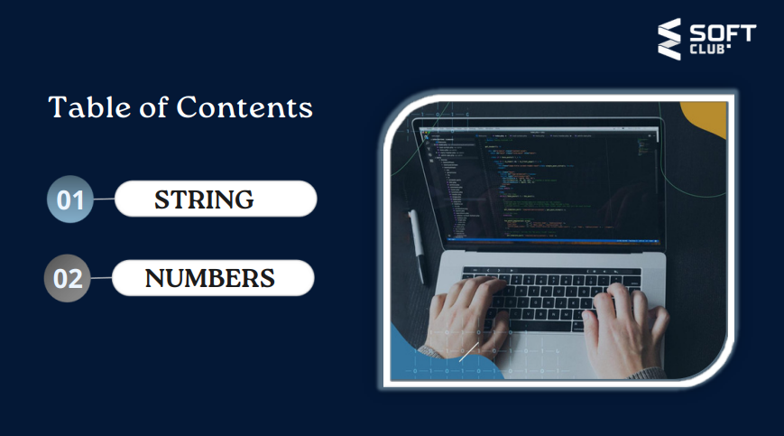
# Что такое Метод ?
... 
### Метод это готовый код , и он работает только тогда когда мы его позовём , то есть другими словами Метод это готовая Функция !
...
### Методы используются для выполнения определенных действий, и они также известны как функции 
...
# Есть 3 типа как создать String в JS :   1.Double Quotes   2.Single Quotes   3.Backticks 
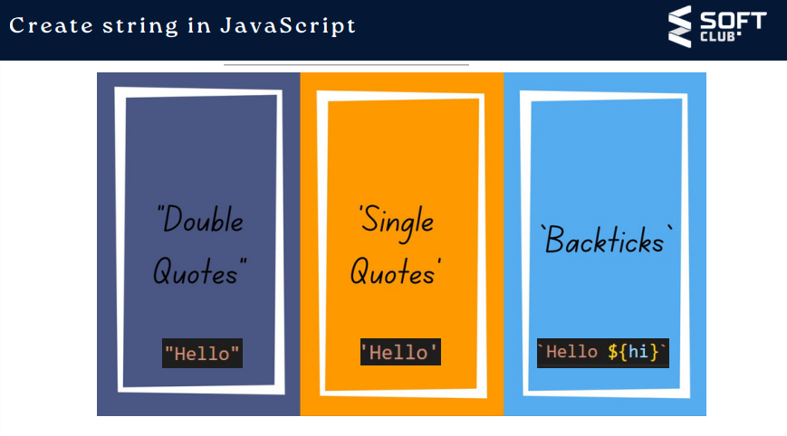
...
# String Методы в JS :
...
#   1. charAt()   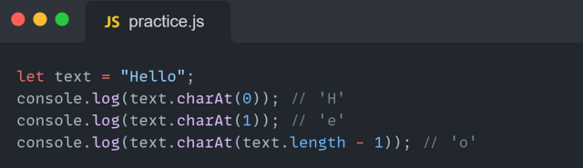   2. at()   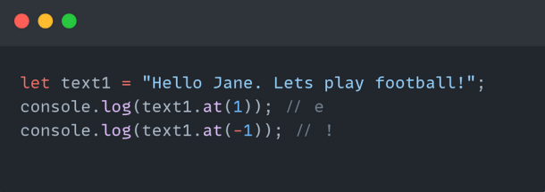   3. concat()   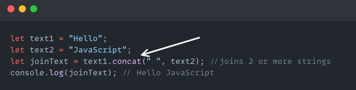  4. trim()   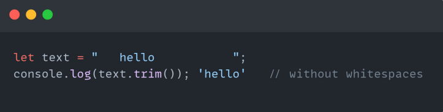   5. includes()   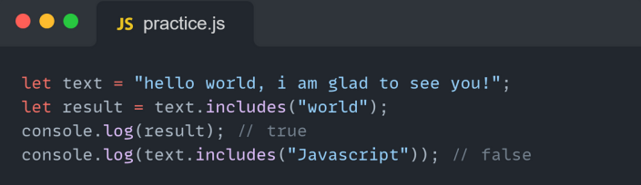   6. indexOf()   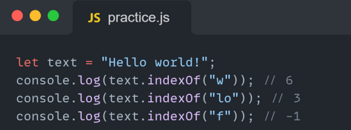   7. replace(),      replaceAll()   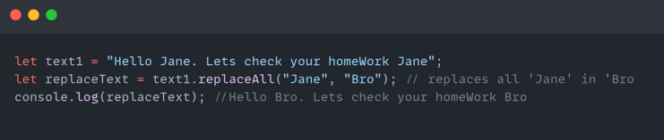   8. repeat()   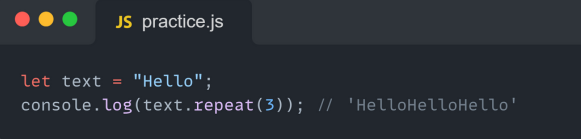   9. slice()   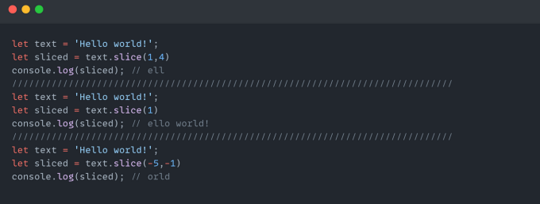   10. substring()   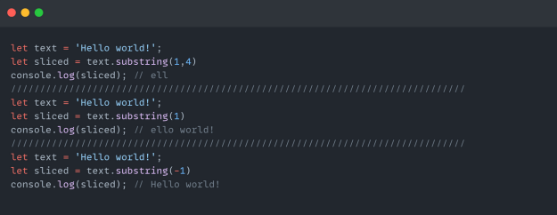   11. split()   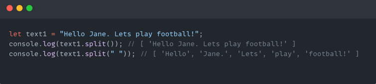   12. toString()   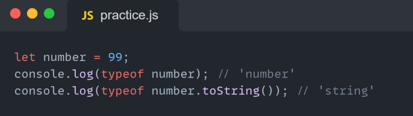   13. toLowerCase()   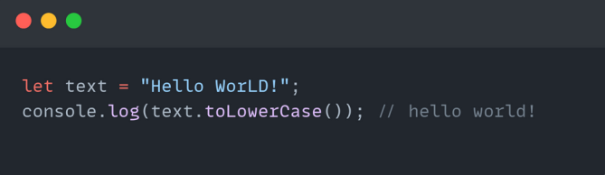   14. toUpperCase()   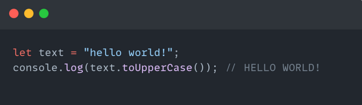
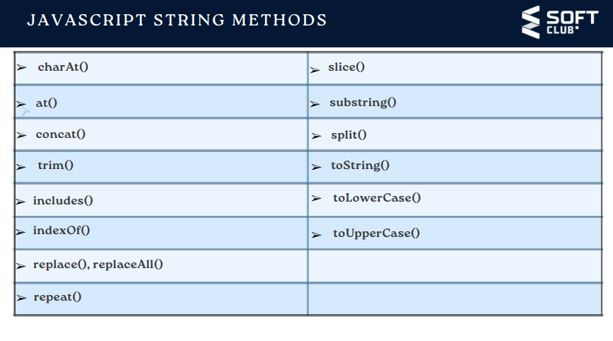
# Number Методы в JS 
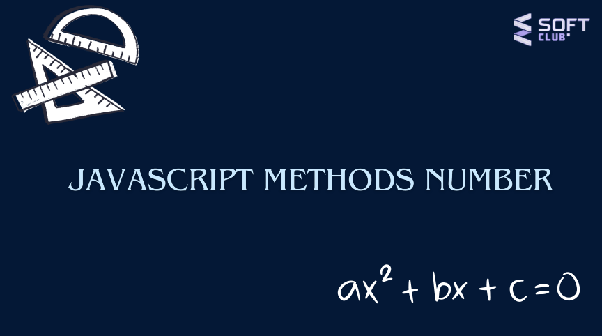 
# Math.floor()   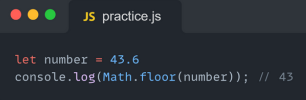   Math.round()   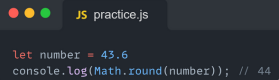   Math.ceil()   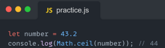   Math.max()   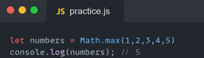   Math.min()   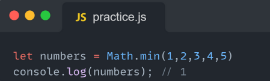   Math.pow()   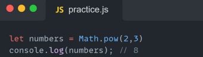   Math.sqrt()   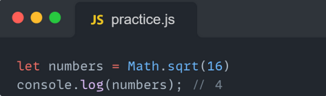   Math.abs()   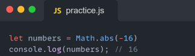   Math.random()   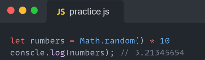   isNaN()   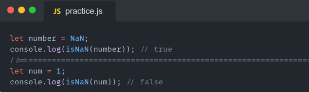