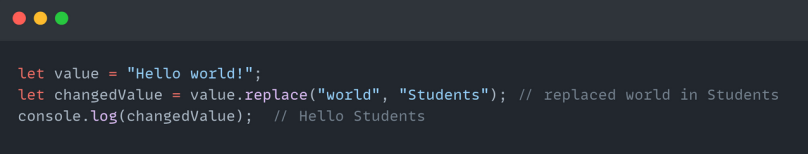

# Что такое Метод ?
... 
### Метод это готовый код , и он работает только тогда когда мы его позовём , то есть другими словами Метод это готовая Функция !
...
### Методы используются для выполнения определенных действий, и они также известны как функции 
...
# Есть 3 типа как создать String в JS :   1.Double Quotes   2.Single Quotes   3.Backticks 

...
# String Методы в JS :
...
#   1. charAt()   
# С помошью этого метода мы можем находить буквы по индексам , но этот метод не принимает отрицательные цифры  
...
# 2. at()  
# С помошью этого метода мы тоже можем находить буквы по индексам , но этот метод принимает отрицательные цифры  
...
# 3. concat()   
# С помошью этого метода мы можем соеденять друг с другом несколько String - ов , то есть составить из двух String - ов один String  
...
# 4. trim()  
# С помошью этого метода мы можем удалять лишние пробелы с начала текста и с конца , то есть если пользователь перед тем как что то написать поставить несколько пробелов то этот метод автоматически удаляет их или же после того как что то написал 
...
# 5. includes()  
# Этот метод выполняет поиск в нутри нашего String-a наше заданное слово , если наше слово в нутри String-a то он покажет true , если же его нет то false  
...
# 6. indexOf()  
# С помошью того метода мы можем находить какой индекс у буквы которую мы хотим узнать  
...
# 7. replace(),   
# С помошью этого метода мы можем поменять свой String на что пожелаем , то есть мы выбираем из нашего String - а ту часть которую мы хотим поменять и меняем его на то что нам нужно , и при этом он меняет только один раз когда мы его вызовем  
# replaceAll()   
# этот метод работает так же как и replace но этот метод меняет столько раз сколько в нашем String - е повторяется то слово которую мы хотим поменять  
# 8. repeat()  
# С помошью этого метода мы можем повторять наш string сколько раз нам угодно  
...
# 9. slice()  
# Этот метод принимает два значения : Начальный индекс и Конечный индекс , то есть метод выдает нам текс по начальному и конечному индексу и этот метод принимает отрицательные цифры  
# 10. substring()  
# Этот метод точно такой же как и Slice но наш метод не принимает отрицательные цифры  
# 11. split()  
# Этот метод создает вокруг нашего String-a масив , то есть наш текст будет находиться в нутри массива  
# 12. toString()  
# Этот метод может поменять тип Number -a на String , то есть из цифр сделать текст  
# 13. toLowerCase()  
# Этот метод делает все буквы в нашем String-e маленькими  
# 14. toUpperCase()  
# А этот метод делает все буквы нашего String-a большими 

# Number Методы в JS 
 
# Math.floor()  
#    Math.round()      Math.ceil()      Math.max()      Math.min()      Math.pow()      Math.sqrt()      Math.abs()      Math.random()      isNaN()   